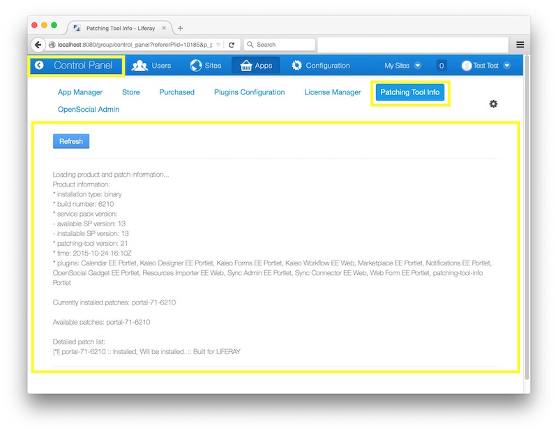

# Liferay Patching Tool Info Portlet

**liferay-patching-tool-info-portlet**

The Liferay Patching Tool Info portlet display details from the Liferay Portal Enterprise Edition (EE) patching tool.

## Overview

The Liferay Patching Tool Info portlet captures details from the [Liferay Portal](https://www.liferay.com/documentation/liferay-portal/6.2/user-guide) Enterprise Edition (EE) [patching tool](https://www.liferay.com/documentation/liferay-portal/6.2/user-guide/-/ai/patching-liferay-liferay-portal-6-2-user-guide-18-en) and displays those details in the Liferay Portal Control Panel.

The patching details can be useful to portal administrators when reviewing portal configuration and/or submitting support requests.

NOTE: The [patching tool](https://www.liferay.com/documentation/liferay-portal/6.2/user-guide/-/ai/patching-liferay-liferay-portal-6-2-user-guide-18-en) is a command line tool packaged with Liferay Portal EE. Hence, the Liferay Patching Tool Info portlet is only available for Liferay Portal 6.1.x EE and 6.2.x EE.

* Refer to [Home](https://github.com/permeance/liferay-patching-tool-info-portlet/wiki/Home) wiki article.

## Supported Products

* Refer to [Supported Products](https://github.com/permeance/liferay-patching-tool-info-portlet/wiki/Supported-Products) wiki article.

## Downloads

* Refer to [Downloads](https://github.com/permeance/liferay-patching-tool-info-portlet/wiki/Downloads) wiki article.

## Configuration

* Refer to [Configuration](https://github.com/permeance/liferay-patching-tool-info-portlet/wiki/Configuration) wiki article.

## Installation

* Refer to [Installation](https://github.com/permeance/liferay-patching-tool-info-portlet/wiki/Installation) wiki article.

## Usage

* Refer to [Usage](https://github.com/permeance/liferay-patching-tool-info-portlet/wiki/Usage) wiki article.

## Source

* Refer to [Source](https://github.com/permeance/liferay-patching-tool-info-portlet/wiki/Source) wiki article.

## Building

* Refer to [Building](https://github.com/permeance/liferay-patching-tool-info-portlet/wiki/Building) wiki article.

## Troubleshooting

* Refer to [Troubleshooting](https://github.com/permeance/liferay-patching-tool-info-portlet/wiki/Troubleshooting) wiki article.

## Authors

* Terry Mueller <terry.mueller@permeance.com.au>
* Tim Telcik <tim.telcik@permeance.com.au>

