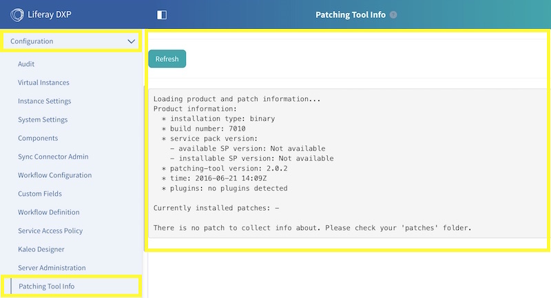
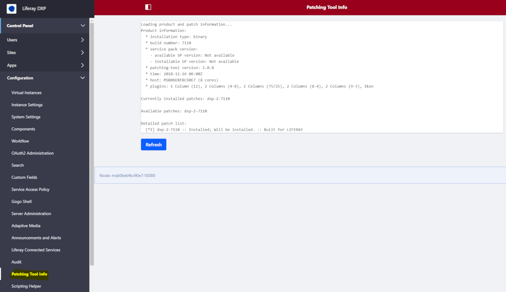

# Liferay Patching Tool Info Portlet

**liferay-patching-tool-info-portlet**

The Liferay Patching Tool Info portlet displays details from the Liferay Portal EE or Liferay DXP patching tool.

## Overview

The Liferay Patching Tool Info portlet displays details from the Liferay DXP  [patching tool](https://www.liferay.com/documentation/liferay-portal/6.2/user-guide/-/ai/patching-liferay-liferay-portal-6-2-user-guide-18-en) in the Liferay Portal Control Panel.

The patching details can be useful to portal administrators when reviewing portal configuration and/or submitting support requests.

For more details, refer to the project [wiki](https://github.com/permeance/liferay-patching-tool-info-portlet/wiki).

## Sample Screens

### Liferay Portal 7.0 DXP Control Panel Configuration

### Liferay Portal 7.1 DXP Control Panel Configuration

## Supported Products

Refer to the [Supported Products](https://github.com/permeance/liferay-patching-tool-info-portlet/wiki/Supported-Products) wiki article.

## Quickstart

Refer to the [Quickstart](https://github.com/permeance/liferay-patching-tool-info-portlet/wiki/Quickstart) wiki article.

## Configuration

Refer to the [Configuration](https://github.com/permeance/liferay-patching-tool-info-portlet/wiki/Configuration) wiki article.

## Downloads

Refer to the [Downloads](https://github.com/permeance/liferay-patching-tool-info-portlet/wiki/Downloads) wiki article.

## Installation

Refer to the [Installation](https://github.com/permeance/liferay-patching-tool-info-portlet/wiki/Installation) wiki article.

## Usage

Refer to the [Usage](https://github.com/permeance/liferay-patching-tool-info-portlet/wiki/Usage) wiki article.

## Source

Refer to the [Source](https://github.com/permeance/liferay-patching-tool-info-portlet/wiki/Source) wiki article.

## Troubleshooting

Refer to the [Troubleshooting](https://github.com/permeance/liferay-patching-tool-info-portlet/wiki/Troubleshooting) wiki article.

## Contacts

Refer to the [Contacts](https://github.com/permeance/liferay-patching-tool-info-portlet/wiki/Contacts) wiki article.

## Support

Refer to the [Support](https://github.com/permeance/liferay-patching-tool-info-portlet/wiki/Support) wiki article.

## License

Refer to the [License](https://github.com/permeance/liferay-patching-tool-info-portlet/wiki/License) wiki article.
